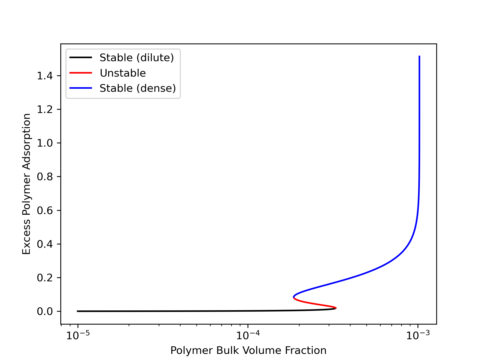
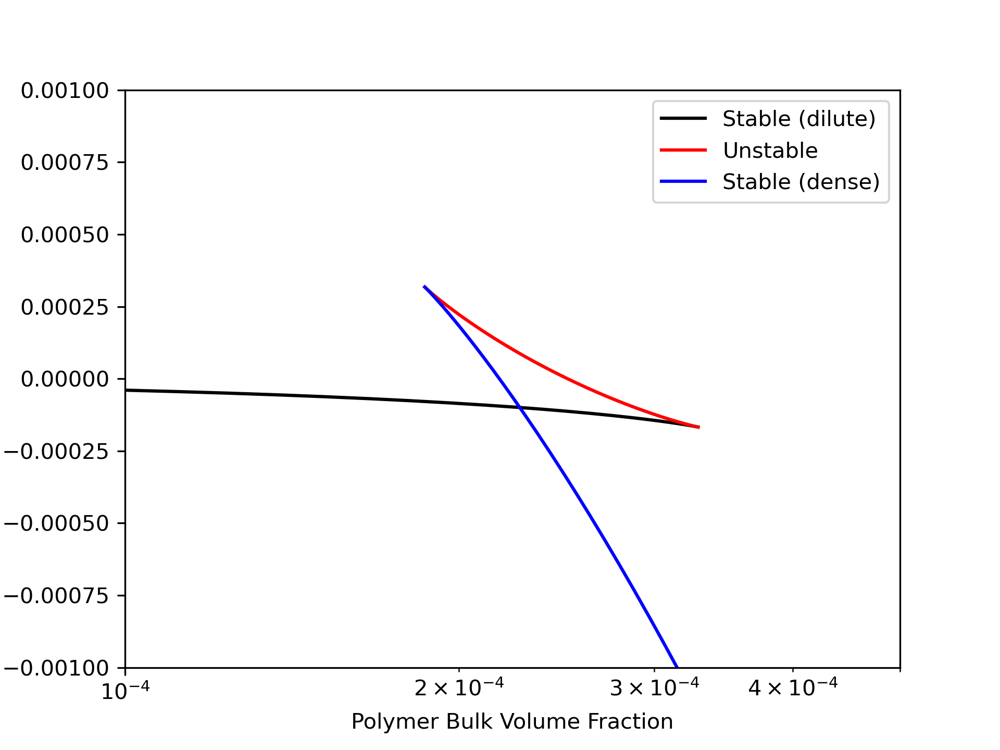

# Wetting of Complex Coacervates
This repository generally contains routines to study interfacial behavior for polyelectrolyte complex coacervates. This code calculates the density profiles of a polyanion, polyanion and salt (+/-) near a single surface based on [Wetting Behavior of Complex Coacervates](https://doi.org/10.1039/D2SM00859A).

**Author** - Christopher Balzer

## Compiling and Running Code
Navigate to ``run/`` and compile using the Makefile with ``make``.  Note that the default compiler in the Makefile is ``g++`` with the OpenMP flag. The program should compile with any ``gcc`` compiler that supports OpenMP. 

### Starting a calculation
Once you have compiled, edit the ``input.dat`` file as necessary. Then run the command

```
./WettingCC
```

The output will automatically be generated in the ``run/example/`` folder.

### Dependencies
This code requires the header library [Eigen](https://gitlab.com/libeigen/eigen) to run. For convenience, the necessary parts of Eigen are included in ``src/external``.

## Numerics
After formulating a theoretical model (free energy) $W$, we seek solutions that extremize the free energy. Mathematically, we seek

```math
\mathbf{H}(\mathbf{x}) = \frac{\delta W(\mathbf{x}) }{\delta \mathbf{x}} = 0
```

where $\mathbf{x}$ is the combined vector of all of our relevant fields (multiple spatially dependent fields), $W(\mathbf{x})$ is the relevant free energy for the configuration $\mathbf{x}$. One can formulate this as a multidimensional root-finding problem, where Newton or quasi-Newton methods are appropriate. Alternatively, we can formulate this as a fixed-point iteration problem by rewriting,

```math
\mathbf{F}(\mathbf{x}) = \mathbf{H}(\mathbf{x}) + \mathbf{x}
```

Then, we seek to solve the fixed-point iteration problem $\mathbf{x} = \mathbf{F}(\mathbf{x})$. In this work, we utilize Anderson Acceleration (also called Pulay mixing or DIIS) to iteratively solve the fixed-point iteration.

```math
\mathbf{x}_{n+1} = (1-\alpha) \sum_{i = 0}^m  \beta_i \mathbf{x}_{n + i -m} + \alpha \sum_{i = 0}^m  \beta_i \mathbf{F}_{n + i -m}
```
where the coefficients $`\beta = \rm{argmin} || (\mathbf{F}_k - \mathbf{x}_k) \beta ||_2 `$ with $`\sum  \beta = 1`$.  Thus, on each iteration, one must solve a least squares problem to determine the coefficients $\beta$. The value of $m$ determines how many previous iterations are used in making the next guess.

## Example Results
The example calculation calculates the equilibrium distribution and electric potential field near a single surface for a symmetrically adsorbing polycation/polyanion through the process of an adsorption isotherm. Namely, a sweep of the bulk polyelectrolyte density is done sequentially using a pseudo-arclength continuation (PAC) scheme. The salient results are shown below. The PAC algorithm allows for easy evaluation of the turning points (thermodyanmic spinodal points) based on the border between stable and unstable regions of the adsorption isotherm, which have been highlighted/colored.


